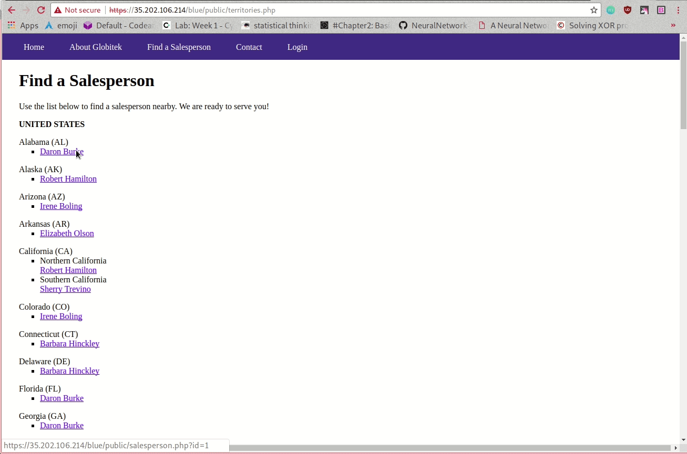
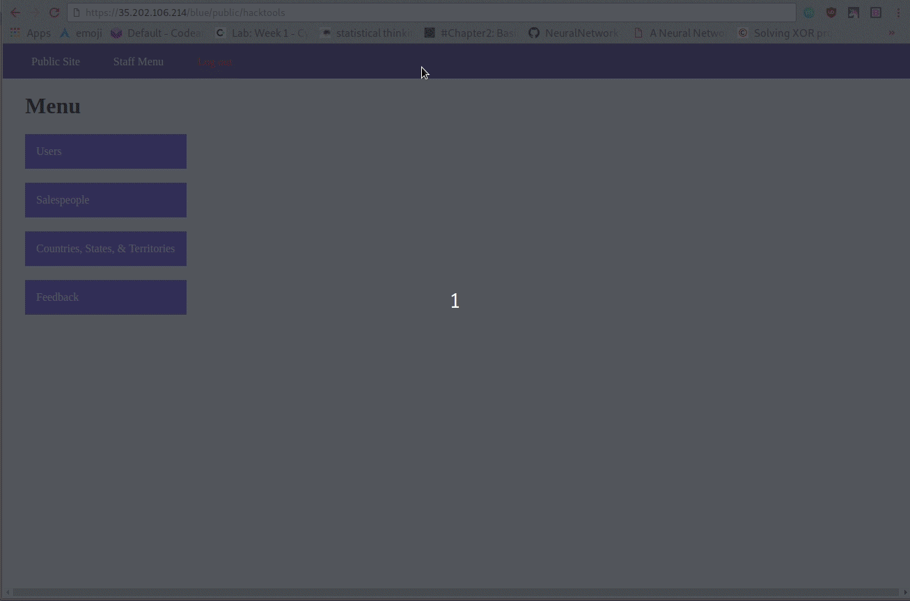
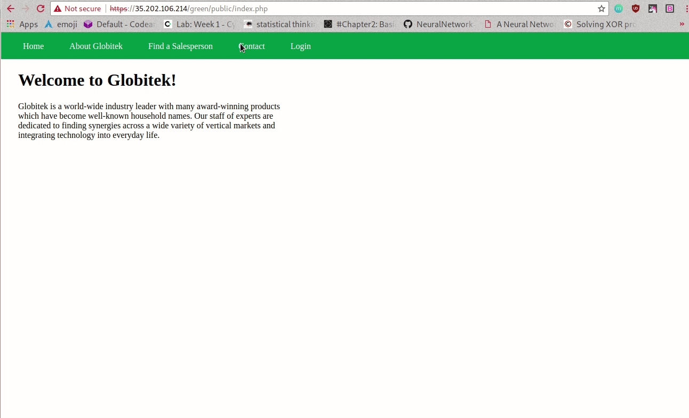
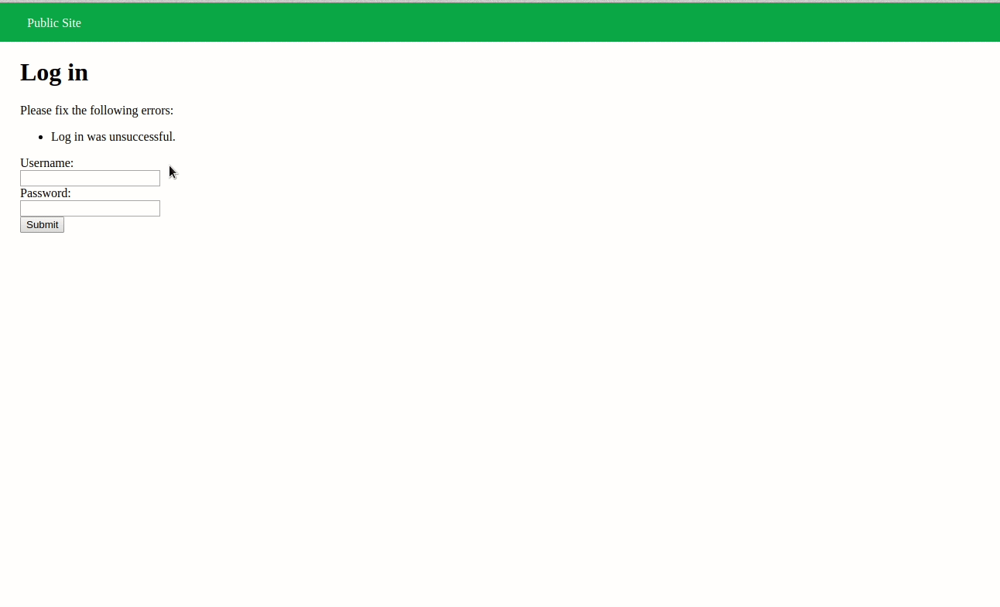
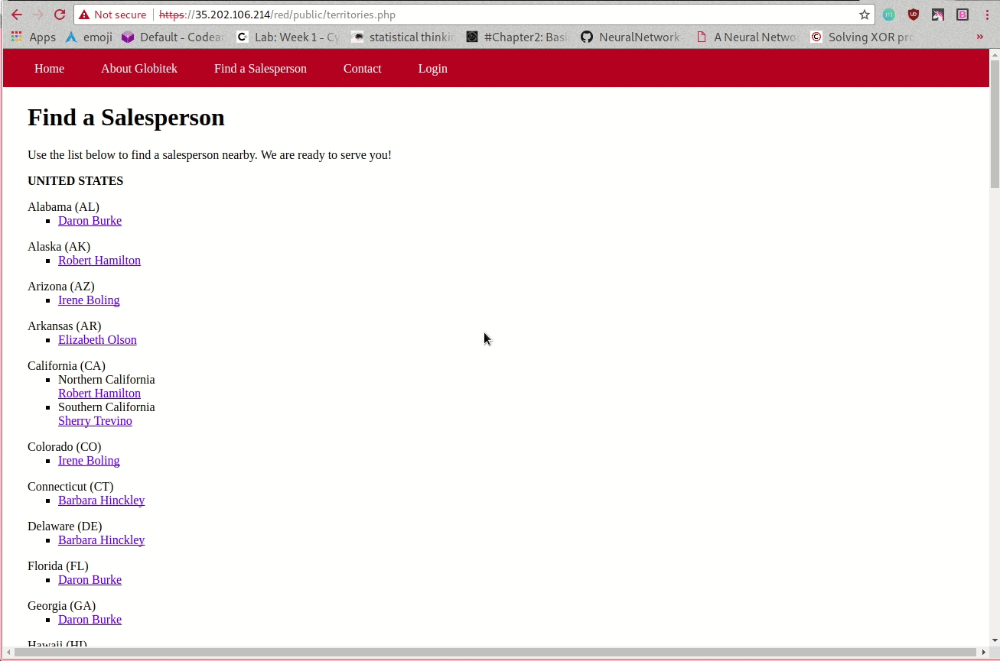

# Project 8 - Pentesting Live Targets

Time spent: **4** hours spent in total

> Objective: Identify vulnerabilities in three different versions of the Globitek website: blue, green, and red.

The six possible exploits are:
* Username Enumeration
* Insecure Direct Object Reference (IDOR)
* SQL Injection (SQLi)
* Cross-Site Scripting (XSS)
* Cross-Site Request Forgery (CSRF)
* Session Hijacking/Fixation

Each version of the site has been given two of the six vulnerabilities. (In other words, all six of the exploits should be assignable to one of the sites.)

## Blue

Vulnerability #1: Session Hijacking: I can get the php session id when logged in, and then pasting it in another browser that is not logged in.

Vulnerability #2: SQLi, `' OR SLEEP(3)=0--'` can make the website sleep for 3 seconds before refreshing. 

## Green

Vulnerability #1: XSS, when `` is inserted into a message, it will open an alert when trying to see the feedback.

Vulnerability #2: User emnumeration, the error message of entering a valid email address is different from a invalid one. If the error message is bolded then the username entered is valid, other wise it's not.

## Red

Vulnerability #1: IDOR, when the id number 10 is inserted into the URl, it displays information that is not yet suppose to be public.

Vulnerability #2: 

## Notes

Describe any challenges encountered while doing the work
